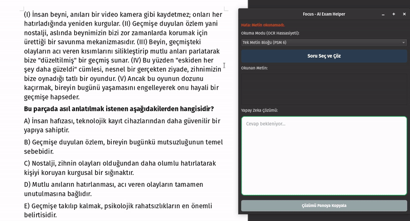

Focus - Yapay Zeka Destekli Sınav Asistanı

Focus, ekranınızdaki herhangi bir sınav sorusunu, metni veya karmaşık paragrafı saniyeler içinde analiz edip çözen, açık kaynaklı bir masaüstü uygulamasıdır. Özellikle Sözel Mantık ve uzun paragraflar için optimize edilmiştir.

Arka planda Groq API (Llama-3.3-70b) gücünü kullanarak, ekran görüntüsünden metne (OCR) ve metinden çözüme giden süreci tamamen otomatikleştirir.

🚀 Özellikler

📸 Akıllı Ekran Yakalama: Seçtiğiniz alanı otomatik algılar.

🧠 Sözel Mantık Modu: Karmaşık mantık sorularını, öncülleri analiz ederek adım adım çözer.

👁️ Gelişmiş OCR & Görüntü İşleme: OpenCV desteği ile görüntü gürültüsünü temizler, Tesseract ile en net okumayı yapar.

⚡ Hızlı Çözüm: Groq altyapısı sayesinde saniyeler içinde yanıt üretir.

🖥️ Çapraz Platform: Hem Windows hem de Linux (Pop!_OS/Ubuntu) üzerinde sorunsuz çalışır.

🪄 Akıllı Kurulum: İlk açılışta eksik ayarları (API Key vb.) sizin için yapılandıran sihirbaz.

📥 Kurulum
Son Kullanıcılar İçin (Windows)
Kodlarla uğraşmanıza gerek yok!

Sağ taraftaki Releases kısmına gidin.

En güncel sürümdeki Focus_Kurulum_Full.exe dosyasını indirin.

Kurulumu yapın (Tesseract OCR ve gerekli sistem dosyaları otomatik kurulacaktır).

Uygulamayı açın ve ücretsiz Groq API anahtarınızı girin.

Geliştiriciler İçin (Kaynak Kod)
Proje Python 3.10+ gerektirir.

Repoyu Klonlayın:

git clone https://github.com/utkunix/Focus.git
cd Focus
Sanal Ortam Oluşturun (Önerilen):

# Windows
python -m venv venv
.\venv\Scripts\activate

# Linux/Mac
python3 -m venv venv
source venv/bin/activate
Bağımlılıkları Yükleyin:

pip install -r requirements.txt
Tesseract OCR Kurulumu:

Windows: https://github.com/tesseract-ocr/tesseract

Linux: sudo apt install tesseract-ocr

Çalıştırın:

python main.py
Kullanım
Uygulamayı başlatın.

"Seç ve Çöz" butonuna tıklayın.

Ekranınızda çözülmesini istediğiniz soruyu seçin.

Focus, görüntüyü işler, soruyu okur ve cevabı ekrana getirir.

İsterseniz cevabı tek tıkla kopyalayabilirsiniz.

----------

Focus - AI Powered Exam Assistant

Focus is an open-source desktop application that analyzes and solves any exam question, text, or complex paragraph on your screen in seconds. It is specifically optimized for Verbal Logic and long texts.

It automates the process from Screenshot to OCR and from Text to Solution using the power of Groq API (Llama-3.3-70b) in the background.

🚀 Key Features
📸 Smart Screen Capture: Select any area on your screen instantly.

🧠 Verbal Logic Mode: Solves complex logic puzzles by analyzing premises step-by-step.

👁️ Advanced OCR & Preprocessing: Uses OpenCV to clean image noise and Tesseract for high-accuracy text extraction.

⚡ Lightning Fast: Generates responses in seconds thanks to Groq infrastructure.

🖥️ Cross-Platform: Runs smoothly on both Windows and Linux (Pop!_OS/Ubuntu).

🪄 Smart Setup Wizard: Automatically guides you through the initial setup (API Key, etc.) on first run.

📥 Installation
For End Users (Windows)
No coding required!

Go to the Releases section.

Download the latest Focus_Kurulum_Full.exe.

Run the installer (It automatically installs Tesseract OCR and system requirements).

Launch the app and enter your free Groq API key.

For Developers (Source Code)
Requires Python 3.10+.

Clone the Repo:

git clone https://github.com/utkunix/Focus.git
cd Focus
Create Virtual Environment (Recommended):

# Windows
python -m venv venv
.\venv\Scripts\activate

# Linux/Mac
python3 -m venv venv
source venv/bin/activate
Install Dependencies:

pip install -r requirements.txt
Install Tesseract OCR:

Windows: https://github.com/tesseract-ocr/tesseract

Linux: sudo apt install tesseract-ocr

Run:

python main.py
Usage
Start the application.

Click the "Capture & Solve" (Seç ve Çöz) button.

Select the question area on your screen.

Focus processes the image, reads the text, and displays the solution.

You can copy the solution with a single click.

📄 License
This project is licensed under the MIT License - see the LICENSE file for details.

👨‍💻 Author
Utku Kalender - Initial work

## 🎥 Nasıl Çalışır?

